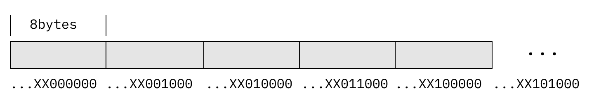
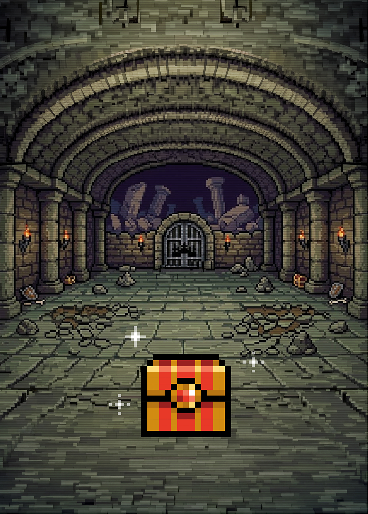
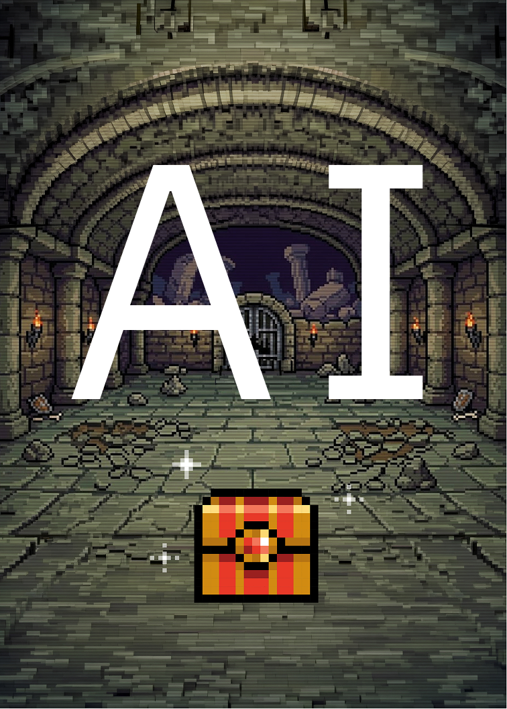
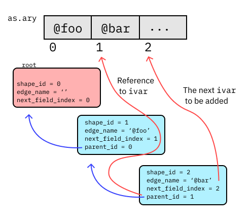

# {#cover}

## About Me

- youchan
- ANDPAD Inc.
  - RubyKaigi Ruby suponsor
  - I will be handing out boxed lunches on Day 2
- Author of [Gibier2](https://github.com/youchan/gibier2)
- Member of
  - Asakusa.rb
  - PicoPicoRuby

## The CRuby Adventure Book


## How to Read CRuby Source Code

- General tips for reading C code, regardless of CRuby
- CRuby-specific details

## Tips for Reading General C Code

- Aim to get a rough overview first
- Narrow down the areas you need to read

## Tip 1

%large: Identify sections you can skip

## `#if - #endif`

Determined at compile time.
Usually for options or specific environments (JIT, WASM, etc.).
Occasionally, some are enabled by default, so be aware of anything that seems out of place.

---

[file vm.c:2771]

```c
VALUE
vm_exec(rb_execution_context_t *ec)
{
    VALUE result = Qundef;
    EC_PUSH_TAG(ec);
    _tag.retval = Qnil;
#if defined(__wasm__) && !defined(__EMSCRIPTEN__)
    /* Skip this section */
#else
    enum ruby_tag_type state;
    if ((state = EC_EXEC_TAG()) == TAG_NONE) {
        if (UNDEF_P(result = jit_exec(ec))) {
            result = vm_exec_core(ec);
        }
        /* fallback to the VM */
        result = vm_exec_loop(ec, TAG_NONE, &_tag, result);
    }
    else {
        result = vm_exec_loop(ec, state, &_tag, ec->errinfo);
    }
#endif
    EC_POP_TAG();
    return result;
}
```
## Error handling

%large: If you find something like assert(), skip it

---

[file vm_insnhelper.c:2362]

```c
if (LIKELY(vm_cc_class_check(cc, klass))) {
    if (LIKELY(!METHOD_ENTRY_INVALIDATED(vm_cc_cme(cc)))) {
        VM_ASSERT(callable_method_entry_p(vm_cc_cme(cc)));
        RB_DEBUG_COUNTER_INC(mc_inline_hit);
        VM_ASSERT(vm_cc_cme(cc) == NULL ||                        // not found
                  (vm_ci_flag(cd->ci) & VM_CALL_SUPER) ||         // search_super w/ define_method
                  vm_cc_cme(cc)->called_id == vm_ci_mid(cd->ci)); // cme->called_id == ci->mid

        return cc;
    }
    RB_DEBUG_COUNTER_INC(mc_inline_miss_invalidated);
}
```

## Debugging-related

%large: This is common with `#if`, but flags are sometimes used in option handling as well

---

[file debug_counter.h:366]

```c
#if USE_DEBUG_COUNTER
/* snip ... */
inline static int
rb_debug_counter_add(enum rb_debug_counter_type type, int add, int cond)
{
/* snip ... */
}

/* snip ... */

#define RB_DEBUG_COUNTER_INC(type)                rb_debug_counter_add(RB_DEBUG_COUNTER_##type, 1, 1)
/* snip ... */
#else
#define RB_DEBUG_COUNTER_INC(type)              ((void)0)
/* snip ... */
#endif
```

## Sections unrelated to what you want to know

%large: Since the relevance is often low, you may want to come back to them later, but it’s fine to skip them initially

---

[file vm_insnhelper.c:5965]

```c
static VALUE
vm_find_or_create_class_by_id(ID id,
                              rb_num_t flags,
                              VALUE cbase,
                              VALUE super)
{
    rb_vm_defineclass_type_t type = VM_DEFINECLASS_TYPE(flags);

    switch (type) {
      case VM_DEFINECLASS_TYPE_CLASS:
        /* classdef returns class scope value */
        return vm_define_class(id, flags, cbase, super);

      case VM_DEFINECLASS_TYPE_SINGLETON_CLASS:
        /* classdef returns class scope value */
        return rb_singleton_class(cbase);

      case VM_DEFINECLASS_TYPE_MODULE:
        /* classdef returns class scope value */
        return vm_define_module(id, flags, cbase);

      default:
        rb_bug("unknown defineclass type: %d", (int)type);
    }
}
```

## Tip 2: Start with the Purpose

For large functions, read from the bottom

Most often, they end with `return <objective>`.
The return value is usually the objective.
Conversely, the beginning often contains error handling (asserts, early returns) or setup.
Don’t read the setup at first. If you do read it, make sure you know the objective first.

---

[file compile.c:14742]

```c
VALUE
rb_iseq_ibf_dump(const rb_iseq_t *iseq, VALUE opt)
{
    struct ibf_dump *dump;
    struct ibf_header header = {{0}};
    VALUE dump_obj;
    VALUE str;

    if (ISEQ_BODY(iseq)->parent_iseq != NULL ||
        ISEQ_BODY(iseq)->local_iseq != iseq) {
        rb_raise(rb_eRuntimeError, "should be top of iseq");
    }
    if (RTEST(ISEQ_COVERAGE(iseq))) {
        rb_raise(rb_eRuntimeError, "should not compile with coverage");
    }

    dump_obj = TypedData_Make_Struct(0, struct ibf_dump, &ibf_dump_type, dump);
    ibf_dump_setup(dump, dump_obj);

    ibf_dump_write(dump, &header, sizeof(header));
    ibf_dump_iseq(dump, iseq);
```

---

```c
    header.magic[0] = 'Y'; /* YARB */
    header.magic[1] = 'A';
    header.magic[2] = 'R';
    header.magic[3] = 'B';
    header.major_version = IBF_MAJOR_VERSION;
    header.minor_version = IBF_MINOR_VERSION;
    header.endian = IBF_ENDIAN_MARK;
    header.wordsize = (uint8_t)SIZEOF_VALUE;
    ibf_dump_iseq_list(dump, &header);
    ibf_dump_object_list(dump, &header.global_object_list_offset, &header.global_object_list_size);
    header.size = ibf_dump_pos(dump);

    if (RTEST(opt)) {
        VALUE opt_str = opt;
        const char *ptr = StringValuePtr(opt_str);
        header.extra_size = RSTRING_LENINT(opt_str);
        ibf_dump_write(dump, ptr, header.extra_size);
    }
    else {
        header.extra_size = 0;
    }

    ibf_dump_overwrite(dump, &header, sizeof(header), 0);

    str = dump->global_buffer.str;
    RB_GC_GUARD(dump_obj);
    return str;
}
```

---

[file compile.c:12668]

```c
static void
ibf_dump_overwrite(struct ibf_dump *dump, void *buff, unsigned int size, long offset)
{
    VALUE str = dump->current_buffer->str;
    char *ptr = RSTRING_PTR(str);
    if ((unsigned long)(size + offset) > (unsigned long)RSTRING_LEN(str))
        rb_bug("ibf_dump_overwrite: overflow");
    memcpy(ptr + offset, buff, size);
}
```

---

`TypedData_Make_Struct`

[file include/ruby/internal/core/rtypeddata.h:483]

```c
 * Identical to #TypedData_Wrap_Struct,  except it allocates a  new data region
 * internally instead of taking an existing  one.  The allocation is done using
 * ruby_calloc().
```

`TypedData_Wrap_Struct`

[file include/ruby/internal/core/rtypeddata.h:452]

```c
 * Converts sval, a pointer to your struct, into a Ruby object.
```

---

[file compile.c:14728]

```c
static void
ibf_dump_setup(struct ibf_dump *dump, VALUE dumper_obj)
{
    dump->global_buffer.obj_table = NULL; // GC may run before a value is assigned
    dump->iseq_table = NULL;

    RB_OBJ_WRITE(dumper_obj, &dump->global_buffer.str, rb_str_new(0, 0));
    dump->global_buffer.obj_table = ibf_dump_object_table_new();
    dump->iseq_table = st_init_numtable(); /* need free */

    dump->current_buffer = &dump->global_buffer;
}
```

---

[file compile.c:12648]

```c
static ibf_offset_t
ibf_dump_write(struct ibf_dump *dump, const void *buff, unsigned long size)
{
    ibf_offset_t pos = ibf_dump_pos(dump);
#if SIZEOF_LONG > SIZEOF_INT
    /* ensure the resulting dump does not exceed UINT_MAX */
    if (size >= UINT_MAX || pos + size >= UINT_MAX) {
        rb_raise(rb_eRuntimeError, "dump size exceeds");
    }
#endif
    rb_str_cat(dump->current_buffer->str, (const char *)buff, size);
    return pos;
}
```


## Tip 3: Knowledge of the Target Is Important

%large: If you know what the program does or have knowledge of the algorithm, you can read it smoothly.

---

- The CRuby parser consists of `parse.y` and `prism`.  It’s also important to know the name “prism.”
- Modular GC and mmtk [RubyKaigi 2025](https://rubykaigi.org/2025/presentations/peterzhu2118.html)
- How does CRuby allocate heap memory?
- How are instance variables stored?

## CRuby-Specific Considerations

Things to know to make reading CRuby source code easier:

- The `VALUE` type
- `rb_define_method()` function
- `insns.def`

## The `VALUE` Type

%large: It appears all over the place in CRuby’s source code

```
% git grep VALUE | wc -l
34190
```

## `VALUE` represents a Ruby object

It has three uses

- As an immediate value. `Integer`, `Flonum`, `Symbol`
- As a special constant. `true`, `false`, `nil`
- As a pointer to a Ruby object

## Immediate Value

| Object         | Structure       | Description                              |
| -------------- | --------------- | -------------------------                |
| Integer        | `...xxxxxxx1`   | Small integers in the high-order bits    |
| Flonum         | `...xxxxxx10`   | Part of a double in a 64-bit environment |
| Symbol         | `...00001100`   | Symbol object ID                         |

## Special Constants

| Object  | Value  | Structure | C Constant |
|---------|--------|-----------|------------|
| `false` | `0x00` | `...0000` | `Qfalse`   |
| `nil`   | `0x08` | `...0100` | `Qnil`     |
| `true`  | `0x14` | `..10100` | `Qtrue`    |
| `undef` | `0x24` | `.110100` | `Qundef`   |

## Pointer

Since the heap allocated for Ruby objects is aligned to 8-byte boundaries, the lower 3 bits are always `000`.



## `rb_define_method()` function

Defining C Functions as Ruby Methods

How are Ruby methods implemented within CRuby?

```c
rb_define_method(rb_cISeq, "to_binary", iseqw_to_binary, -1);
```

## `insns.def`

ISeq instructions are defined

Various other files are generated from this file

```c
/* Get local variable (pointed by `idx' and `level').
     'level' indicates the nesting depth from the current block.
 */
DEFINE_INSN
getlocal
(lindex_t idx, rb_num_t level)
()
(VALUE val)
{
    val = *(vm_get_ep(GET_EP(), level) - idx);
    RB_DEBUG_COUNTER_INC(lvar_get);
    (void)RB_DEBUG_COUNTER_INC_IF(lvar_get_dynamic, level > 0);
}
```

## ここまでのまとめ

- Aim to get a rough overview first
- Narrow down the areas you need to read

---

- Identify sections you can skip
- Start with the Purpose
- Knowledge of the Target Is Important

---

%large: That said,
I don't really know anything about that...

## The Ultimate Secret



## The Ultimate Secret



---

%large: I learned about the `VALUE` type from Gemini

## Claude Code

- Can be run in the source code repository
  - Can lock the code version
- Set the language to “gal-speak”(ギャル語)

## What I Learned Using Claude Code

- Call Cache
- Object Shape

## How are Ruby methods called?

In ISeq, method calls correspond to instructions such as `send` and `opt_send_without_block`.

---

[file insns.def:892]

```c
/* Invoke method without block */
DEFINE_INSN
opt_send_without_block
(CALL_DATA cd)
(...)
(VALUE val)
// attr bool zjit_profile = true;
// attr bool handles_sp = true;
// attr rb_snum_t sp_inc = sp_inc_of_sendish(cd->ci);
// attr rb_snum_t comptime_sp_inc = sp_inc_of_sendish(ci);
{
    VALUE bh = VM_BLOCK_HANDLER_NONE;
    val = vm_sendish(ec, GET_CFP(), cd, bh, mexp_search_method);
    JIT_EXEC(ec, val);

    if (UNDEF_P(val)) {
        RESTORE_REGS();
        NEXT_INSN();
    }
}
```

---

In C, `vm_sendish()` serves as the entry point

[file vm_insnhelper.c:6123]

```c
        calling.cc = cc = vm_search_method_fastpath((VALUE)reg_cfp->iseq, cd, CLASS_OF(recv));
        val = vm_cc_call(cc)(ec, GET_CFP(), &calling);
```
Retrieving the callcache (`cc`)

As the name suggests, callcache speeds up operations through caching.

---

[file vm_insnhelper.c:2356]

```c
static const struct rb_callcache *
vm_search_method_fastpath(VALUE cd_owner, struct rb_call_data *cd, VALUE klass)
{
    const struct rb_callcache *cc = cd->cc;

#if OPT_INLINE_METHOD_CACHE
    if (LIKELY(vm_cc_class_check(cc, klass))) {
        if (LIKELY(!METHOD_ENTRY_INVALIDATED(vm_cc_cme(cc)))) {
            VM_ASSERT(callable_method_entry_p(vm_cc_cme(cc)));
            RB_DEBUG_COUNTER_INC(mc_inline_hit);
            VM_ASSERT(vm_cc_cme(cc) == NULL ||                        // not found
                      (vm_ci_flag(cd->ci) & VM_CALL_SUPER) ||         // search_super w/ define_method
                      vm_cc_cme(cc)->called_id == vm_ci_mid(cd->ci)); // cme->called_id == ci->mid

            return cc;
        }
        RB_DEBUG_COUNTER_INC(mc_inline_miss_invalidated);
    }
    else {
        RB_DEBUG_COUNTER_INC(mc_inline_miss_klass);
    }
#endif

    return vm_search_method_slowpath0(cd_owner, cd, klass);
}
```

---

If `cd->cc` contains a callcache, use it.
If there is no callcache, call `vm_search_method_slowpath0()` and set the callcache as well.

## What is `call_data`

It contains information about which method to call in response to method calls such as `send` or `opt_send_without_block` in ISeq.

---

```
vm_search_method_slowpath0
└── rb_vm_search_method_slowpath
    └── vm_search_cc
```

`vm_search_cc()` is called

---

[file vm_insnhelper.c:2267]

```c
static const struct rb_callcache *
vm_search_cc(const VALUE klass, const struct rb_callinfo * const ci)
{
    const ID mid = vm_ci_mid(ci);

    const struct rb_callcache *cc = vm_lookup_cc(klass, ci, mid);
    if (cc) {
        return cc;
    }

    RB_VM_LOCKING() {
        if (rb_multi_ractor_p()) {
            // The CC may have been populated by another ractor while we were waiting on the lock,
            // so we must lookup a second time.
            cc = vm_lookup_cc(klass, ci, mid);
        }

        if (!cc) {
            cc = vm_populate_cc(klass, ci, mid);
        }
    }

    return cc;
}
```

---

`vm_lookup_cc()` looks up `cc` in `RCLASS_WRITABLE_CC_TBL`
`RCLASS_WRITABLE_CC_TBL` is an extension area associated with the class
`vm_populate_cc()` creates `cc` and writes it to `RCLASS_WRITABLE_CC_TBL`

## How the callcache Works

- The first call creates a callcache and stores it in `RCLASS_WRITABLE_CC_TBL`. It is also stored in `call_data`.
- The second call uses `call_data->cc`.
- If a different `call_data` is used, the callcache is retrieved from `RCLASS_WRITABLE_CC_TBL` and stored in `call_data`.

## Object Shape

Data structures for managing instance variables (`ivar`)

It was introduced at RubyKaigi 2022 https://rubykaigi.org/2022/presentations/jemmaissroff.html#day2

## How `ivar`s are managed

Object creation

```c
rb_define_alloc_func(rb_cBasicObject, rb_class_allocate_instance);
```

```c
NEWOBJ_OF_WITH_SHAPE(o, struct RObject, klass, flags, rb_shape_root(rb_gc_heap_id_for_size(size)), size, 0);
```

## RObject

```c
struct RObject {
    struct RBasic basic;
    union {
        struct {
            VALUE *fields;
        } heap;

        VALUE ary[1];
    } as;
};
```

`ivar` is stored in `as.ary`

## Generating `ivar`

`ivar` is generated dynamically

For example, if there is a class like the one below, simply calling `MyClass.new` will not create `@bar`

```ruby
class MyClass
  def initialize
    @foo = :foo
  end

  def bar
    @bar = :bar
  end
end
```

## Shape

`ivar` is stored in `as.ary` (or `as.heap`) in the order in which it was created.
Shape keeps track of the order in which `ivar` was created.

---

```c
struct rb_shape {
    VALUE edges; // id_table from ID (ivar) to next shape
    ID edge_name; // ID (ivar) for transition from parent to rb_shape
    redblack_node_t *ancestor_index;
    shape_id_t parent_id;
    attr_index_t next_field_index; // Fields are either ivars or internal properties like `object_id`
    attr_index_t capacity; // Total capacity of the object with this shape
    uint8_t type;
};
```

---

| Field Name       | Description                      |
|------------------|----------------------------------|
| edges            | Mapping to the destination shape |
| edge_name        | ivar name (`@foo`)               |
| parent_id        | Parent shape ID                  |
| next_field_index | Index of the next destination    |

---



## Claude Code(Gal) says

**OMG, ivar access is gonna be like, lightning fast now!**

Since we know the Shape, we already know `@bar` is sitting right there at index 1. That means we don't have to waste time doing a table search for the ivar name! Objects from the same class usually set their ivars in the same order, so they can share the same shape—which makes caching work like a charm!

**ivarのアクセスが速くなる〜！**

shapeがわかれば、`@bar` が「インデックス1に入ってる」ってわかるから、ivar名でテーブル検索する必要がない！同じクラスのオブジェクトは同じ順序でivarをセットすることが多いから、同じshapeを共有できて、キャッシュが効きやすいの！

## Conclusion

- I’ve shared a few tips on how to read CRuby source code
- Let’s use AI to fill in the gaps in our knowledge
- Gals are literally the GOAT!
