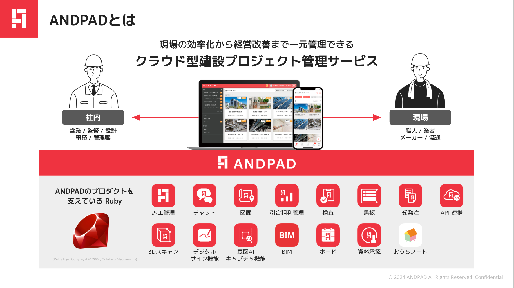
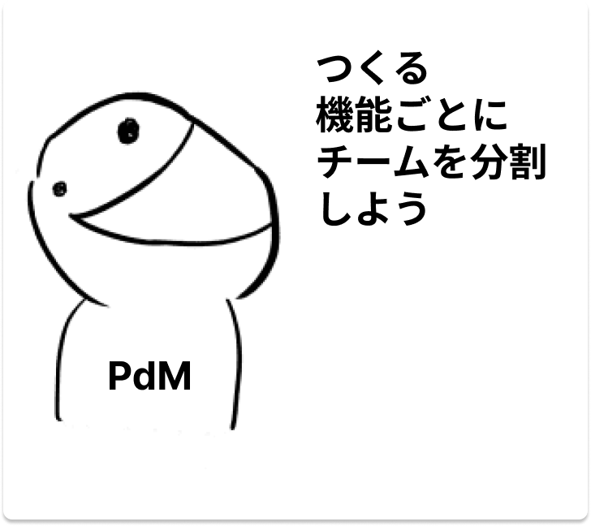
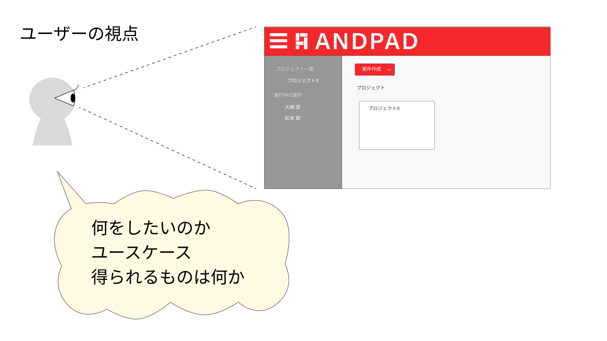
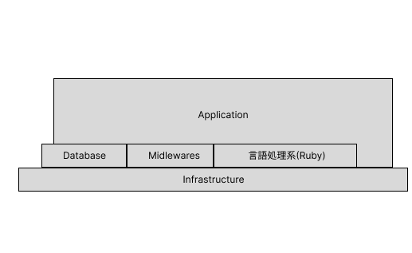
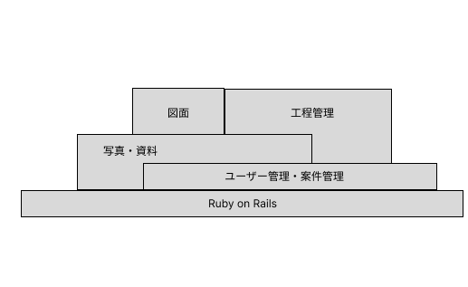
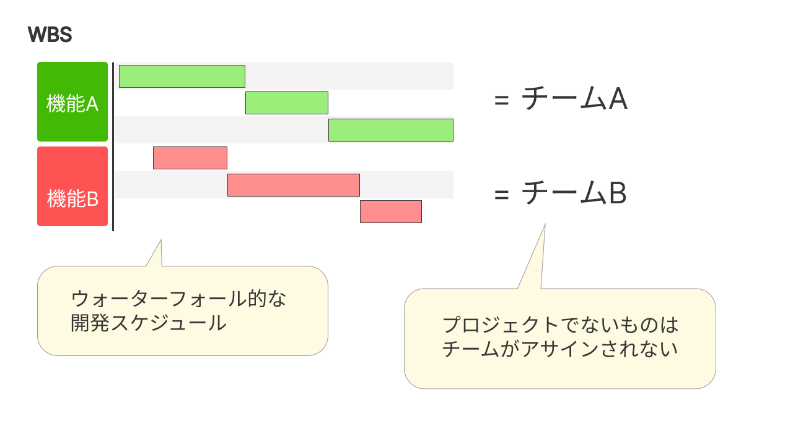
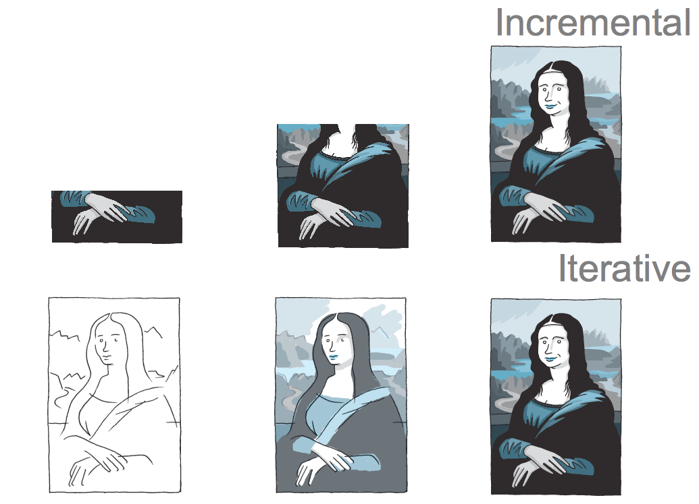
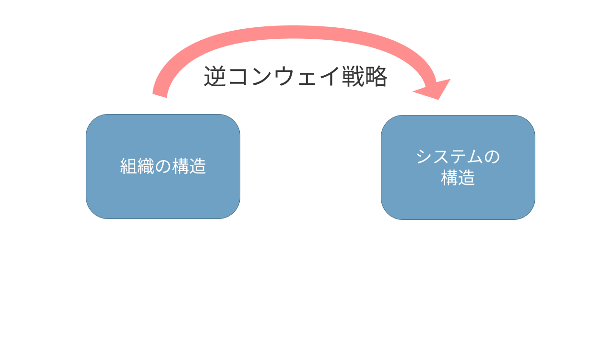
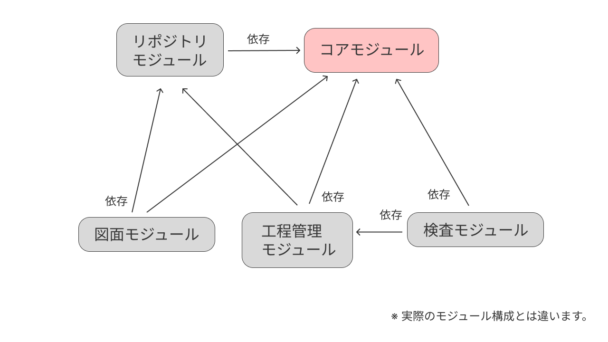
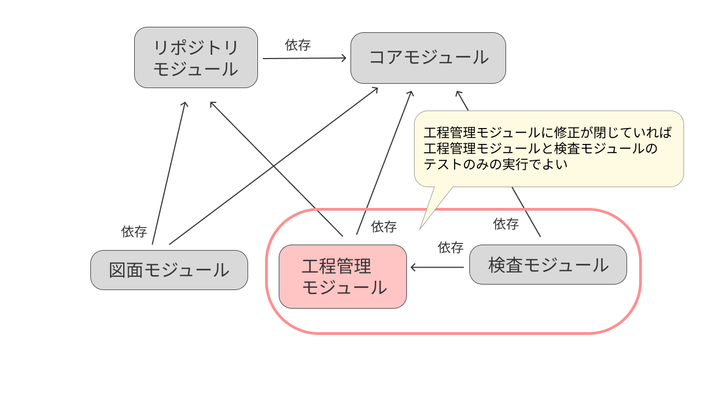

# スケールする組織をモジュラーモノリスで制する{#cover}

%author: 大崎 瑶 (@youchan)

## 自己紹介

- 大崎 瑶 (@youchan)
- 株式会社アンドパッド
- Rubyist
  - asakusa.rb
- Gibier2
  - プレゼンテーションツール

## 株式会社アンドパッド

## スケールする開発組織の課題

SaaSを提供する企業がスケールするとき、提供するサービスが多角化していくことでシステムがより複雑になる。
複雑化するシステムに対応するための開発組織の課題とは？

*※ 今日のお話しは個人的な課題感です。株式会社アンドパッドとしてのコンセンサス示すものではありません。*

# 経験を元にお話します

---

---

## なぜ、チームが機能単位で分割されるのか？

%caption:何故そのように考えるのか？それが悪いことなのか？開発者との視点の違いから明らかにしていく

## ユーザーから見たシステム

## 開発者から見たシステム

## 開発者から見たシステム

# PdM(あるいはPO・PM)はユーザー視点に近い

## プロジェクト管理

## インクリメンタルとイテレーティブ

%caption: 視点によってこのように作り方が変わる

# 継続的な改善をするチーム ≠ プロジェクトチーム

%project:プロジェクトチームは機能がデリバリーされれば新しいプロジェクトにアサインされる

# 開発組織(チーム)を開発者の手に！！

## コンウェイの法則

%conway:「システムを設計する組織は、そのコミュニケーション構造をそっくりまねた構造の設計を生み出してしまう」
-- メルヴィン・コンウェイ

## 逆コンウェイ戦略

%caption:コンウェイの法則を逆手に取って、理想のシステムアーキテクチャに合わせてチームを構成する

## モジュラーモノリスはシステムの構造を可視化する

モノリスはシステムの境界が分かりにくく、どのようにチームを分けるべきか視座を与えない。
モジュラーモノリスにすることでモジュール間の依存関係を定義し、システムの構造を可視化することができる。

## 組織構造とシステム構造

## アンドパッドの場合

- モジュラーモノリスの明確なメリットを定義することは難しい
  - ビジネスの視点からメリットを説明しづらい
  - 開発者体験を損なうことがビジネスに対するデメリットだとも言える
- CIコストの削減を具体なメリットとする
  - PR毎にrspecを実行している
    - 1回約15分、1日500回くらい回っている
  - モジュール毎にrspecを実行することが出来ればコストを削減できる

## CIのコスト削減

## 成果

%caption:過去1000件のPull Requestの変更がモジュールに閉じているかを集計
また、Pull Requestの変更がテスト不要の場合にスキップする対応をしたので、そのケースも集計

---

## まとめ

- システムの見え方はユーザー視点(含むPdM/PO/PM)と開発者視点では違う
- プロジェクト管理やチーム編成を開発者視点を持たないPdM/PO/PMに委ねると
  - 機能単位、プロジェクト単位のチーム編成が行なわれる
      - システムの継続的な改善をするチームを作れない
- モジュラーモノリスはシステムの依存関係を可視化する
  - それによって逆コンウェイ戦略を取ることが出来る(のではないか)
- アンドパッドでは、モジュラーモノリスの明確なメリットを示すためにCIのコスト削減を行なっている
